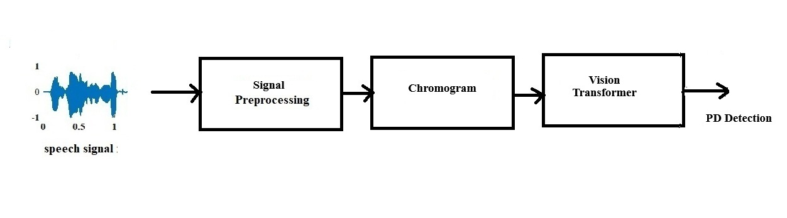
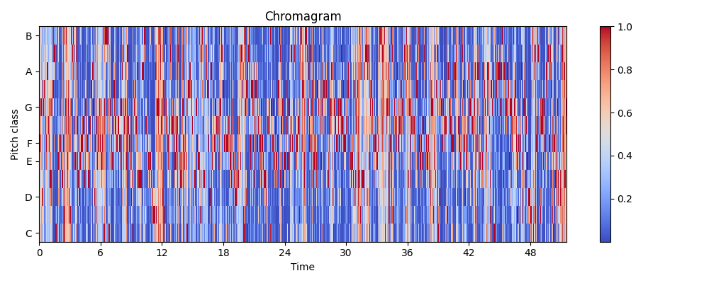
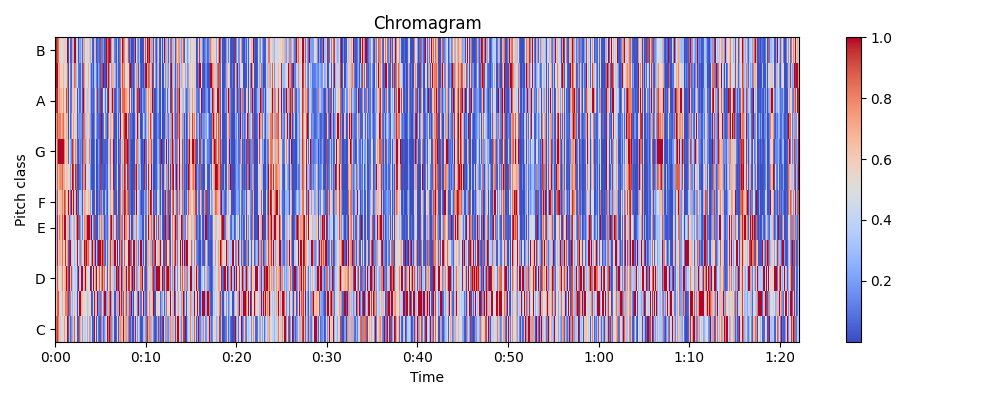
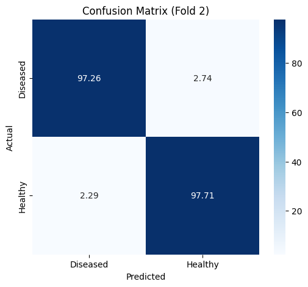
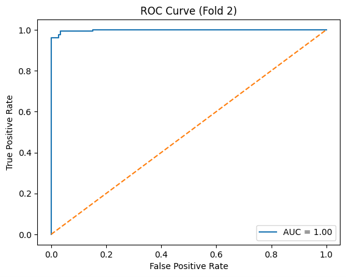

# 🧠 Parkinson's Disease Detection using Chromagram Features and Vision Transformer

### Early-stage Parkinson's Disease classification from speech signals using ViT — achieving 97.47% accuracy, published in IEEE (January 2026)

---

Parkinson's Disease (PD) is a progressive neurodegenerative disorder affecting millions worldwide. Traditional diagnosis methods rely on expensive clinical procedures like DaTscan and MRI, which are time-consuming and inaccessible for early detection. This project proposes a cost-effective, non-invasive deep learning framework that detects PD from speech signals. Speech recordings are converted into **chromagram feature plots** — 2D visual representations of pitch-class energy — which are then classified using a fine-tuned **Vision Transformer (ViT)** model. Validated on the Italian Parkinson's Speech Dataset using 5-fold cross-validation, the framework achieves **97.47% classification accuracy**, outperforming all prior state-of-the-art methods on the same dataset.

> 📄 **Published in IEEE — January 2026**  
> Unnikrishnan Jayan, Dheeraj M, Poorna S S, Anuraj K, Ananthu A C  
> Dept. of ECE, Amrita Vishwa Vidyapeetham

---

## 🔁 Pipeline



```
Speech Signal → Preprocessing → Chromagram Extraction → Vision Transformer → PD / Healthy
```

---

## 🎵 Chromagram Features

Chromagram plots capture the tonal content of speech across 12 pitch classes over time. PD patients show distinct harmonic irregularities compared to healthy controls.

| Healthy Speech | Diseased Speech |
|:-:|:-:|
|  |  |

---

## 📊 Results

### Confusion Matrix


### ROC Curve


### Classification Report

| Class | Precision | Recall | F1-Score |
|-------|-----------|--------|----------|
| Diseased | 0.9793 | 0.9726 | 0.9759 |
| Healthy | 0.9697 | 0.9771 | 0.9734 |
| **Overall Accuracy** | | | **97.47%** |
| AUC | | | **1.00** |

---

## 🏗️ Model Architecture

- **Base Model:** `vit_base_patch16_224` pretrained on ImageNet (via `timm`)
- **Custom Classification Head:**
```
Linear(in_features → 256) → ReLU → Dropout(0.4) → Linear(256 → 1) → Sigmoid
```
- **Loss:** Binary Cross Entropy  
- **Optimizer:** Adam  
- **Validation:** 5-Fold Stratified Cross Validation

---

## 📁 Project Structure

```
├── VIT_notebook_file.ipynb     # Full pipeline notebook
├── requirements.txt            # Dependencies
├── README.md                   # Project documentation
├── block_diagram.jpg           # Pipeline diagram
├── healthy_chroma.png          # Healthy speech chromagram
├── diseased_chroma.png         # Diseased speech chromagram
├── confusion_matrix.png        # Confusion matrix result
├── roc_curve.png               # ROC curve result
└── data/                       # Place dataset here (not included)
```

---

## 🗂️ Dataset

**Italian Parkinson's Speech Dataset**
- 65 native Italian speakers — 28 PD patients, 37 healthy controls
- Recorded at 44.1 kHz, 16-bit resolution
- Download the dataset and place chromagram images in the `/data` directory with subfolders `/data/diseased` and `/data/healthy`

---

## 🚀 How to Run

1. **Clone the repository**
```bash
git clone https://github.com/your-username/parkinsons-vit-detection.git
cd parkinsons-vit-detection
```

2. **Install dependencies**
```bash
pip install -r requirements.txt
```

3. **Run on Google Colab** *(recommended — free GPU)*
   - Upload `VIT_notebook_file.ipynb` to [Google Colab](https://colab.research.google.com/)
   - Mount your Google Drive
   - Update the dataset path in the notebook
   - Run all cells

---

## 📦 Requirements

```
torch
torchvision
timm
scikit-learn
numpy
matplotlib
seaborn
```

---

## 📈 Comparison with State-of-the-Art

| Method | Feature | Classifier | Accuracy |
|--------|---------|------------|----------|
| Toye et al. (2021) | MFCC, HNR | Random Forest | 94.3% |
| Costantini et al. (2023) | MFCC + Wavelet | SVM | 83% |
| Bhatt et al. (2023) | SLT Spectrogram | VGG16 | 96% |
| Di Cesare et al. (2024) | MFCC + GTCC | Cubic SVM | 90% |
| **Proposed (2026)** | **Chromagram** | **Vision Transformer** | **97.47%** |

---

## 📝 Citation

If you use this work, please cite:

```bibtex
@article{unnikrishnan2026parkinsons,
  title={Detection of Parkinson's Disease Integrating Speech-based Chromagram Features and Vision Transformer},
  author={Unnikrishnan Jayan and Dheeraj M and Poorna S S and Anuraj K and Ananthu A C},
  journal={IEEE},
  year={2026}
}
```

---

## 👤 Author

**Unnikrishnan Jayan**  
B.Tech Electronics and Communication Engineering  
Amrita Vishwa Vidyapeetham, India  

[](https://linkedin.com/in/unnikrishnanjayan)
[](mailto:unnikrishnanjayan7@gmail.com)
